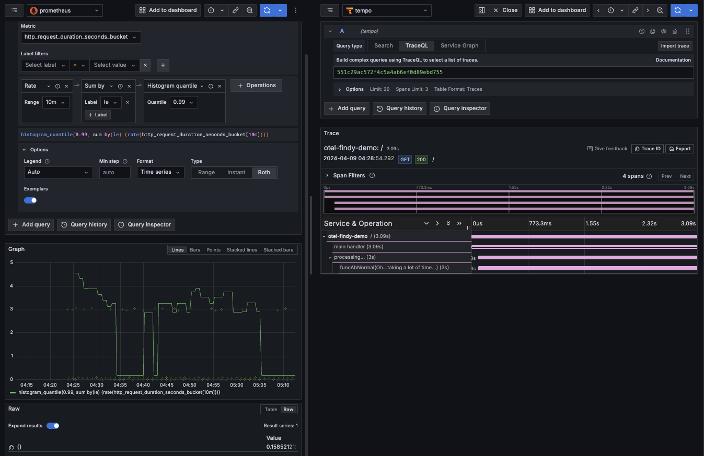

OpenTelemetry Observability運用の実例 Lunch LT で使うデモ用のリポジトリです。

https://findy.connpass.com/event/313260/

## Requirements
- OpenTelemetry Go SDK >= v1.24.0
- Google Kubernetes Engine
- Role
  - roles/cloudtrace.agent
  - roles/monitoring.metricWriter

## /app
Web サーバーアプリケーション。リクエストを受けるとトレースと、サーバーの Duration タイムをヒストグラムメトリクスとして OTel Collector に OTLP で送信する。また、環境変数 `OTEL_GO_X_EXEMPLAR` でトレースエグザンプラーを有効化できる。

### 環境変数
- SERVICE_NAME
- OTEL_COLLECTOR_ENDPOINT
- OTEL_GO_X_EXEMPLAR
- OTEL_METRICS_EXEMPLAR_FILTER

## /deployments

### otel-findy-demo
```sh
# Create Namespace
$ kubectl create ns app

# Deploy Sample Application
$ kubectl apply -f deployments/otel-findy-demo/otel-findy-demo.yaml
```

### otelcol
```sh
# Create Namespace
$ kubectl create ns observability

# Deploy OpenTelemetryCollector
$ kubectl apply -f deployments/otelcol/otelcol.yaml
```

### OSS Observability Stack
```sh
# Deploy Grafana Tempo
$ helm repo add grafana https://grafana.github.io/helm-charts
$ helm repo update
$ helm install tempo-distributed grafana/tempo-distributed -n observability --version 1.9.1 --set traces.otlp.grpc.enabled=true --wait

# Deploy Prometheus
$ helm repo add prometheus-community https://prometheus-community.github.io/helm-charts
$ helm repo update
$ helm install kube-prometheus-stack prometheus-community/kube-prometheus-stack -n observability --version 58.0.0  \
  --set prometheus.prometheusSpec.enableRemoteWriteReceiver=true \
  --set 'prometheus.prometheusSpec.enableFeatures[0]=exemplar-storage' --wait

# Deploy Grafana
$ helm install grafana grafana/grafana -n observability --version 7.3.7 --wait
# Show password of Dashboard
$ kubectl get secret --namespace observability grafana -o jsonpath="{.data.admin-password}" | base64 --decode ; echo
```

## Output

### Google Cloud Stack


### Grafana & Prometheus Stack
